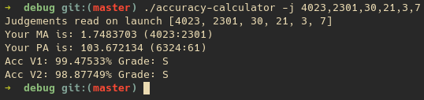

# Terminal osu!mania accuracy calculator made in Rust

-------------------------------------------------------------------------------

Simple terminal accuracy and ratio calculator for osu!mania.
You can execute the application without any parameters and manually insert all the data. <br/>

<br/>

You can also launch the application with arguments, currently implemented arguments are:
```
accuracy-calculator [FLAGS] [OPTIONS]

FLAGS:
-h, --help           Prints help information
-i, --interactive    Launch app in interactive mode
-s, --save           Save result in a csv format
-V, --version        Prints version information

OPTIONS:
-j <judgments>        Pass judgments in format 300g,300,200,100,50,miss
```
*interactive mode requires manual imput of judgments
## Install
### Linux
To install the application you can use makefile after cloning the repo
```
make update
sudo make install
```
To uninstall use

```
sudo make uninstall
```

## Building
If you don't need to install it right away or you are using Windows/MacOS do:
```
$ git clone https://github.com/Moskas/accuracy-calculator-rs.git
$ cd accuracy-calculator-rs
$ cargo build
```

